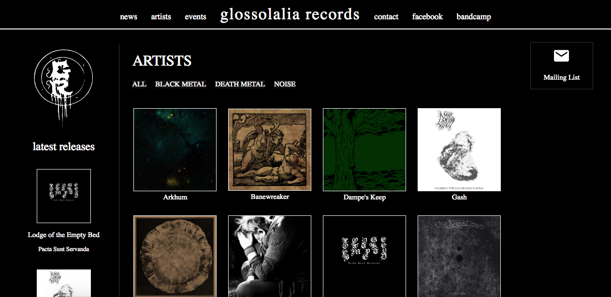

<h1>Glossolalia Records</h1>

The public rebranding of Oregon-based record label Glossolalia Records. This label specializes in releasing underground music from artists
in the black and death metal genres, as well as experimental audio/noise artists.

Current Bandcamp: <a href="https://glossolaliarecords.bandcamp.com/">https://glossolaliarecords.bandcamp.com/</a>

 

<h4>Tech Stack:</h4>
<ul>
  <li>HTML</li>
  <li>CSS</li>
  <li>Javascript</li>
  <li>jQuery</li>
  <li>Python</li>
</ul>
   

<h4>Public Release Date: <strong>January 1, 2019</strong></h4> 
